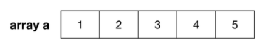
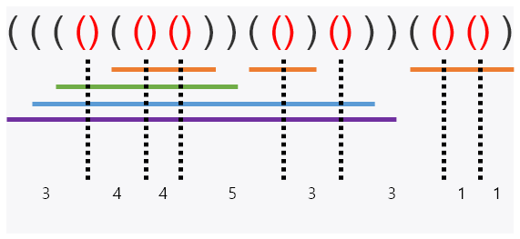

# **10799번 쇠막대기**
https://www.acmicpc.net/problem/10799
## **문제 요구 사항**
여러 개의 쇠막대기를 레이저로 절단하려고 한다. 효율적인 작업을 위해서 쇠막대기를 아래에서 위로 겹쳐 놓고, 레이저를 위에서 수직으로 발사하여 쇠막대기들을 자른다. 쇠막대기와 레이저의 배치는 다음 조건을 만족한다.

쇠막대기는 자신보다 긴 쇠막대기 위에만 놓일 수 있다. - 쇠막대기를 다른 쇠막대기 위에 놓는 경우 완전히 포함되도록 놓되, 끝점은 겹치지 않도록 놓는다.
각 쇠막대기를 자르는 레이저는 적어도 하나 존재한다.
레이저는 어떤 쇠막대기의 양 끝점과도 겹치지 않는다. 
아래 그림은 위 조건을 만족하는 예를 보여준다. 수평으로 그려진 굵은 실선은 쇠막대기이고, 점은 레이저의 위치, 수직으로 그려진 점선 화살표는 레이저의 발사 방향이다.                                          

이러한 레이저와 쇠막대기의 배치는 다음과 같이 괄호를 이용하여 왼쪽부터 순서대로 표현할 수 있다.

1. 레이저는 여는 괄호와 닫는 괄호의 인접한 쌍 ‘( ) ’ 으로 표현된다. 또한, 모든 ‘( ) ’는 반드시 레이저를 표현한다.
2. 쇠막대기의 왼쪽 끝은 여는 괄호 ‘ ( ’ 로, 오른쪽 끝은 닫힌 괄호 ‘) ’ 로 표현된다. 

## **자료 구조**
Array 구조 
* 삽입 / 삭제 : O(N)
* 탐색 : O(1)


## **문제 해결**
1. (, ), () 각 케이스별 동작
   1. ( : 막대기 추가
   2. ) : 막대기 종료
   3. () : 막대기 절단
2. 배열에 넣고 순서대로 탐색을 비교를 하면서 위 동작을 반복합니다. 
3. ( 일경우 cut 될 숫자르 증가 시켜줍니다
4. ) 들어올경우 이전과 비교해서 다르다면 합산을 해줍니다
5. 연속으로 ) 들어올경우 막대기 끝나는 것을 알 수 있습니다.


## **시간복잡도(Big-O)**
해당 문제는 Array의 탐색을 활용합니다.

삽입은 O(N) 탐색은 O(1) 괄호수만큼 반복함으로 O(N) 입니다.

Big-O는 O(2N)이지만 상수는 제거함으로 O(N)입니다.


```python
import sys
laser = sys.stdin.readline().strip('\n')
cut = 0
steel = 0
prev = ''
for l in laser:
    if l == '(':
        cut += 1

    elif prev != l:
        cut -= 1
        steel = steel + cut

    else :
        cut -=1
        steel = steel + 1

    prev=l

print(steel)

```