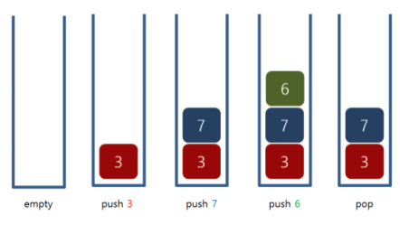

# **1406번 에디터**
https://www.acmicpc.net/problem/1406
## **문제 요구 사항**
한 줄로 된 간단한 에디터를 구현하려고 한다. 이 편집기는 영어 소문자만을 기록할 수 있는 편집기로, 최대 600,000글자까지 입력할 수 있다.

이 편집기에는 '커서'라는 것이 있는데, 커서는 문장의 맨 앞(첫 번째 문자의 왼쪽), 문장의 맨 뒤(마지막 문자의 오른쪽), 또는 문장 중간 임의의 곳(모든 연속된 두 문자 사이)에 위치할 수 있다. 즉 길이가 L인 문자열이 현재 편집기에 입력되어 있으면, 커서가 위치할 수 있는 곳은 L+1가지 경우가 있다.

이 편집기가 지원하는 명령어는 다음과 같다.
| 명령어 | 동작                                                                                                                                                                    |
| ------ | ----------------------------------------------------------------------------------------------------------------------------------------------------------------------- |
| L      | 커서를 왼쪽으로 한 칸 옮김 (커서가 문장의 맨 앞이면 무시됨)                                                                                                             |
| D      | 커서를 오른쪽으로 한 칸 옮김 (커서가 문장의 맨 뒤이면 무시됨)                                                                                                           |
| B      | 커서 왼쪽에 있는 문자를 삭제함 (커서가 문장의 맨 앞이면 무시됨) 삭제로 인해 커서는 한 칸 왼쪽으로 이동한 것처럼 나타나지만, 실제로 커서의 오른쪽에 있던 문자는 그대로임 |
| P      | $	$라는 문자를 커서 왼쪽에 추가함                                                                                                                                       |

## **자료 구조**
Stack 구조를를 사용합니다.
* LIFO(Last In Last Out)
* 삽입 / 삭제 : O(1)


## **문제 해결**
해당 문제는 커서의 위치 이동에 따른 명령어 수행이 중요사항입니다.

커서 위치 파악은 손쉽게 2개의 스택으로 통해 pop, push로 문자열의 커서 위치를 파악이 가능합니다.
1. 2개의 스택을 준비합니다. 하나는 문자열의 스택 하나는 커서 위치에 대한 스택입니다.
2. 커서 이동
   1. 왼쪽 이동 : 커서스택에 pop
3. 문자 삽입이라면 해당위치에서 push를 통해 문자를 입력해서 넣고 만약 삭제라면 문자열 스택에서 pop을 통해 삭제를 시킵니다.


## **시간복잡도(Big-O)**
해당 문제는 pop, push로만 작동합니다 Stack은 삽입삭제시 O(1)이므로 명령어 수 N만큼 동작하기 때문에
Big-O에서는 O(n)의 동작을 하게 됩니다.

```python
import sys

word = sys.stdin.readline().strip()
word_list=[]
cursor = []

for i in word :
    word_list.append(i)

for _ in range(int(sys.stdin.readline())):
    command = sys.stdin.readline().strip()
    if command[0] == 'L' :
        if len(word_list) != 0 :
            cursor.append(word_list.pop())
    elif command[0] == 'D' :
        if len(cursor) != 0 :
            word_list.append(cursor.pop())
    elif command[0] == 'B' :
        if len(word_list) != 0 :
            word_list.pop()
    elif command[0] == 'P' :
        word_list.append(command[-1])

print(''.join(word_list) + ''.join(reversed(cursor)))
```