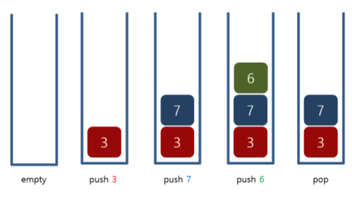

# **17298번 오큰수**
https://www.acmicpc.net/problem/17298

## **문제 요구 사항**
크기가 N인 수열 A = A1, A2, ..., AN이 있다. 수열의 각 원소 Ai에 대해서 오큰수 NGE(i)를 구하려고 한다. Ai의 오큰수는 오른쪽에 있으면서 Ai보다 큰 수 중에서 가장 왼쪽에 있는 수를 의미한다. 그러한 수가 없는 경우에 오큰수는 -1이다.

예를 들어, A = [3, 5, 2, 7]인 경우 NGE(1) = 5, NGE(2) = 7, NGE(3) = 7, NGE(4) = -1이다. A = [9, 5, 4, 8]인 경우에는 NGE(1) = -1, NGE(2) = 8, NGE(3) = 8, NGE(4) = -1이다.
## **자료 구조**
### Stack
* LIFO(Last In Last Out)
* 삽입 / 삭제 : O(1)


## **문제 해결**
### 실수
* 문제입력 N을 확인을 하지 않고 이중 for문을 통해 전체 검색 방법을 사용 O(N²)이기 때문에 시간 초과가 발생
### 해결
1. 오큰수를 못찾는 경우를 생각해서 미리 -1로 n만큼 초기화시켜 준비합니다.
2. 빈 스택이 아니면서 스택 top보다 값이 더 크다면 오큰수이므로 result에 값을 저장하고 스택에서 pop해줍니다.
3. i번째에 비교를 위해 다음 반복을 위해 스택에 i를 추가해줍니다.
4. result 배열에 -1 존재한다면 오큰수를 찾지 못함을 알 수 있습니다.
 
## **시간복잡도(Big-O)**
Stack 삽입 삭제로 동작하기 때문에 O(N)입니다.

``` python
import sys

n = int(sys.stdin.readline())
a = list(map(int, sys.stdin.readline().split()))

#오큰수가 아닐경우 미리 -1로 초기화
result = ["-1" for _ in range(n)]
#인덱스위치 확인용 
idx_stack = []

for i in range(n):
    # 스택위치의 인덱스와 현 위치를 비교 
    while len(idx_stack) != 0 and a[idx_stack[-1]] < a[i]:
        result[idx_stack[-1]] = str(a[i])
        idx_stack.pop()
    idx_stack.append(i)
    
for num in result:
    print(num, end=" ")

```