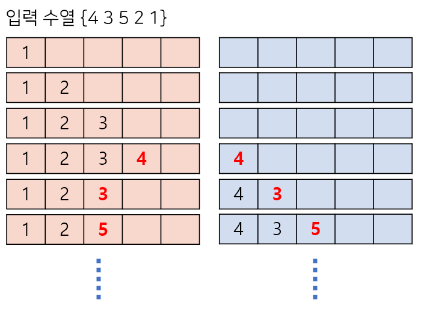

# **스택 수열**
https://www.acmicpc.net/problem/1874
## **문제 요구 사항**
스택 (stack)은 기본적인 자료구조 중 하나로, 컴퓨터 프로그램을 작성할 때 자주 이용되는 개념이다. 스택은 자료를 넣는 (push) 입구와 자료를 뽑는 (pop) 입구가 같아 제일 나중에 들어간 자료가 제일 먼저 나오는 (LIFO, Last in First out) 특성을 가지고 있다.

1부터 n까지의 수를 스택에 넣었다가 뽑아 늘어놓음으로써, 하나의 수열을 만들 수 있다. 이때, 스택에 push하는 순서는 반드시 오름차순을 지키도록 한다고 하자. 임의의 수열이 주어졌을 때 스택을 이용해 그 수열을 만들 수 있는지 없는지, 있다면 어떤 순서로 push와 pop 연산을 수행해야 하는지를 알아낼 수 있다. 이를 계산하는 프로그램을 작성하라.

## **자료 구조**
Stack 구조를를 사용합니다.
* LIFO(Last In Last Out)
* 삽입 / 삭제 : O(1)


## **문제 해결**
1. 1부터 N까지의 스택에 추가를 할때마다 '+' 합니다.
2. 스택에 수열에 해당하는 수가 들어오면 pop을 해주고 '-' 를 표시해줍니다.
3. 만약 해당사항이 없다면 'NO'를 표시해줍니다.
4. 

## **시간복잡도(Big-O)**
Stack의 push, pop만 하기 때문에 O(n)의 시간복잡도를 가집니다.

```python
import sys

def stack_sequence(n) :
    stack = []
    sequence = []
    step = []
    last = 1

    for i in range(n):
        num = int(sys.stdin.readline())
        for j in range(last, num + 1):
            stack.append(j)
            last += 1
            step.append('+')
        if stack[-1] == num:
            sequence.append(stack.pop())
            step.append('-')
        else : 
            print('NO')
            return
            
    for s in step :
        print(s)

n = int(sys.stdin.readline())
stack_sequence(n)
```