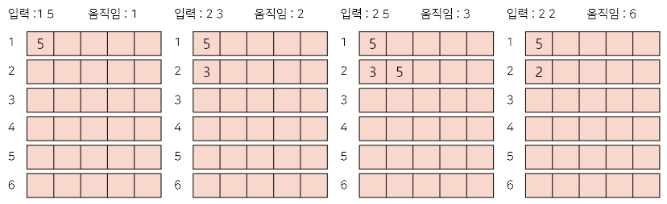

# **2841번 외계인의 기타 연주**
https://www.acmicpc.net/problem/2841
## **자료 구조**
### Stack
* LIFO(Last In Last Out)
* 삽입 / 삭제 : O(1)

## **문제 해결**
1. 해당 줄에 하는 스택을 각자 만들어 줍니다.
2. 입력이 줄에 해당하는 스택 top 보다 클 경우 push해주고 cnt를 증가 시켜줍니다.
3. top과 동일하다면 현 상태를 유지
4. top 보다 작다면 pop을 통해 제거 cnt증가
5. 위 동작을 반복하여 cnt의 값을 출력합니다.


## **시간복잡도(Big-O)**
스택을 통해 삽입/삭제를 활용하는 문제입니다.
O(N) 복잡도를 가집니다.
``` python
import sys

n, p = map(int, sys.stdin.readline().split())
melody = []
max_h = 0
for _ in range(n):
    s, p = map(int, sys.stdin.readline().split())
    melody.append([s, p])

cnt = 0
finger = [[] for i in range(7)]

for s, p in melody:
    #비어 있다면 추가
    if len(finger[s]) == 0:
        finger[s].append(p)
        cnt += 1
    else:
        #최상위 스택과 비교해서 새로운 플랫이 크다면 추가
        if p > finger[s][-1]:
            finger[s].append(p)
            cnt += 1
        elif p != finger[s][-1]:  
            #플랫보다 큰 수 전부 팝으로 제거 cnt 증가
            while len(finger[s]) != 0 and p < finger[s][-1]:
                finger[s].pop()
                cnt += 1
            #비어있다면 추가
            if len(finger[s]) == 0 :
                finger[s].append(p)
                cnt += 1
            #남은 수가 플랫과 같지 않을경우 추가
            elif finger[s][-1] != p:
                finger[s].append(p)
                cnt += 1

print(cnt)

```